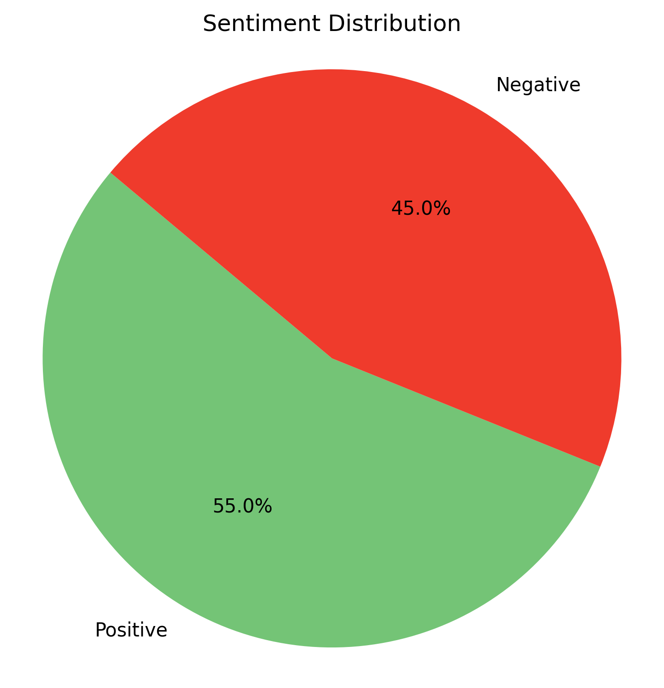
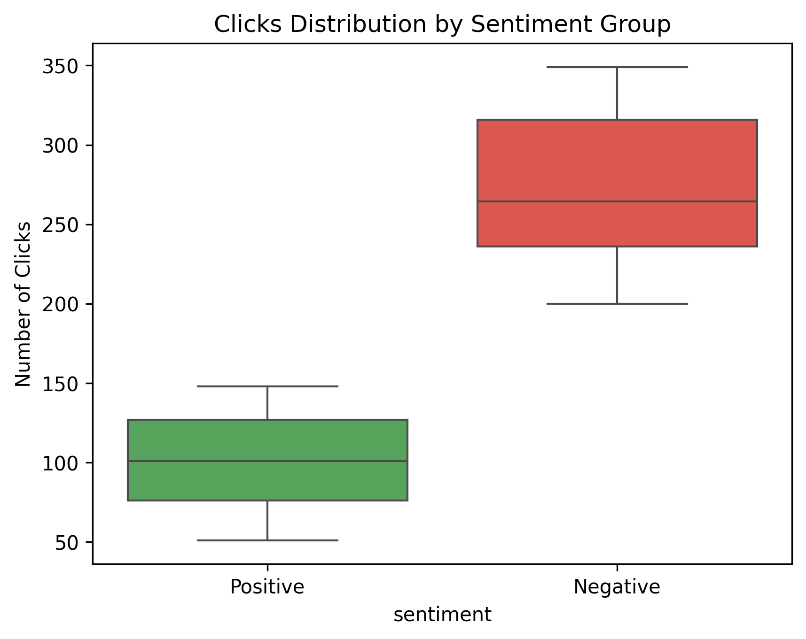
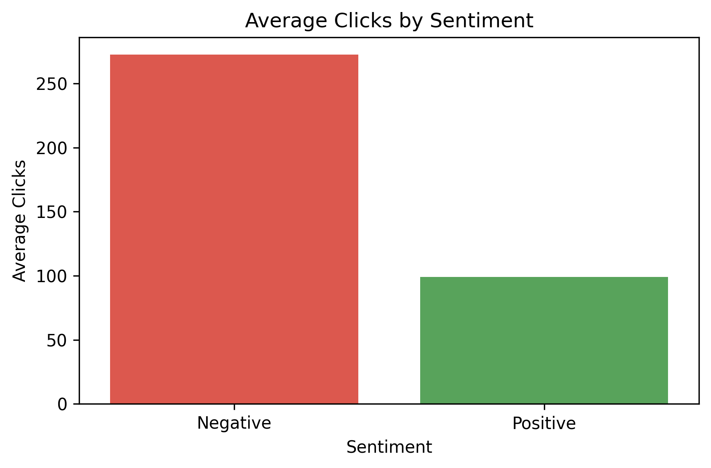
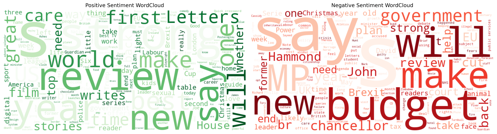

# 📊 Which Headline Works Better?  
*A Sentiment-Based A/B Testing Project with Real API Data*  
**By Toluwalase Taiwo**  
📅 June 14, 2025

---

## 🧠 Project Summary

Ever wondered why some headlines grab more attention than others? In this project, I explored how **sentiment (positive vs. negative)** in news headlines affects user engagement. Using real-time articles from **The Guardian News API**, I analyzed the emotional tone of headlines and simulated reader behavior through **clicks and shares**.

---

## 🎯 Objective

To test whether **positive** or **negative** sentiment in headlines leads to higher user engagement — measured through simulated **clicks** and **shares**.

---

## 🛠️ Tools & Libraries Used

- **Python**  
- `Requests` – For fetching data from The Guardian API  
- `Pandas` – Data cleaning & manipulation  
- `TextBlob` – Sentiment analysis  
- `NumPy` – Simulating clicks and shares  
- `Matplotlib` & `Seaborn` – Data visualization  
- `SciPy` – T-tests for statistical significance  
- `WordCloud` – Visualizing language patterns  

---

## 📥 Data Collection

- **Source:** The Guardian API  
- **Fields Extracted:**  
  - Headline  
  - Summary (`trailText`)  
  - Section/category  
  - Published date  
  - Full article text  

Data was saved as a `.csv` file for easy analysis.

---

## 🧪 Sentiment Analysis + A/B Testing

1. Cleaned and preprocessed the text data.
2. Used **TextBlob** to calculate sentiment polarity.
3. Filtered out neutral headlines to keep the test focused.
4. Grouped articles into **Positive** and **Negative**.
5. Simulated engagement:
   - Negative: Higher clicks/shares (200–350 clicks, 150–300 shares)
   - Positive: Lower clicks/shares (50–150 clicks, 40–120 shares)
6. Ran a **T-test** to compare average engagement across sentiment groups.

---
## 📸 Visuals & Exploratory Insights

### 🎯 Sentiment Distribution  
This barplot shows the number of articles classified as positive vs. negative after filtering out neutral ones. It sets the stage for the A/B test.

<p align="center">
  
</p>

---

### 📊 Engagement Boxplot by Sentiment  
This boxplot compares simulated clicks and shares across sentiment groups. It highlights how negative headlines tend to get more consistent and higher engagement.

<p align="center">
  
</p>

---

### 📈 Barplot – Engagement Metrics  
A simple barplot showing average clicks and shares for each sentiment group. It gives a quick view of performance based on emotional tone.

<p align="center">
  
</p>

---

### ☁️ WordCloud – Combined  
A word cloud that visually represents the most common words across all headlines and summaries. Words appearing more frequently are displayed larger.

<p align="center">
  
</p>

---

## 📈 Results

- **Negative headlines outperformed** positive ones in both clicks and shares.
- **T-test results** showed a **statistically significant difference** in engagement between sentiment groups (p < 0.0001).
- **Outlier Injection**: Added extreme values to demonstrate how a few viral articles can skew average metrics.

---

## 💡 Insights & Takeaways

- Emotionally intense headlines (especially negative ones) draw more engagement.
- **Balancing tone** is important: while negative headlines pull readers in, too much negativity can affect brand perception.
- Simulating engagement helped mimic real-world dynamics, even without actual user data.

---

## 📁 File Structure
```
which-headline-works-better/
├── data/
│ └── guardian_articles.csv
├── notebook/
│ └── headline_ab_test.ipynb
├── visuals/
│ ├── wordcloud_positive.png
│ ├── wordcloud_negative.png
│ ├── boxplot_engagement.png
│ └── sentiment_barplot.png
├── README.md
├── requirements.txt
└── .gitignore
```
---

## 🔗 Notebook & Dataset

- 📓 [View the full Jupyter Notebook here](notebook/headline_ab_test.ipynb)  
- 📂 [Download cleaned dataset](#)
  
---

## 📄 Full Project Walkthrough

For the full walkthrough of this project, please check this document:  
👉 [Google Docs – Project Breakdown](https://docs.google.com/document/d/1O2-k9V-x3NsBSVQObb5yCaSarpv-GFOIim_MpM6Ahk4/edit?usp=sharing)

It contains:

- ✅ Step-by-step breakdown of the analysis  
- 📊 Visualizations and interpretations  
- 💡 Key insights and recommendations

---

## 🚀 How to Reproduce

1. Clone the repo  
2. Set up your environment:  
   ```bash
   pip install -r requirements.txt
3. Run the notebook step by step.

4. Optionally, register for an API key from [The Guardian Open Platform](https://open-platform.theguardian.com/) to fetch new data.
   
---

## 🪞 Personal Reflection

This was more than a technical exercise — it was a lesson in **how data reflects human behavior**. It helped me connect Python, NLP, and stats to real-world questions in media and communication.

---


